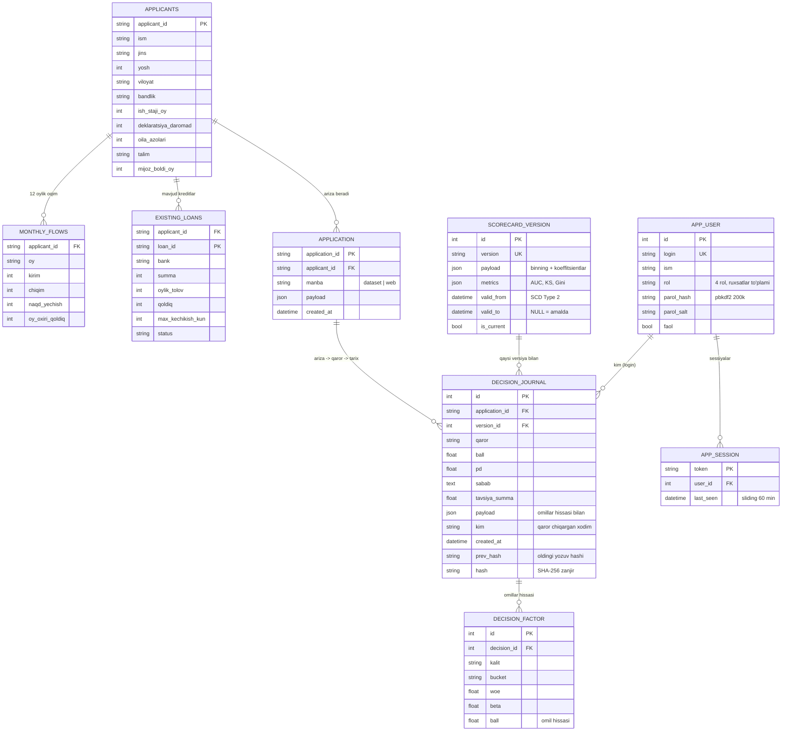

# ERD — ma'lumotlar sxemasi

Ikki qatlam: **dataset** (CSV, faqat o'qish) va **operatsion baza** (SQLite).
Yadro talab: ariza → qaror → tarix zanjiri, o'zgarmas jurnal, SCD Type 2 versiyalar.

## Nega shunday

**O'zgarmaslik ikki qavat himoyada.** `decision_journal` ga UPDATE/DELETE
SQLite triggerlari bilan taqiqlangan (`RAISE(ABORT)`). Trigger o'chirilsa ham,
har bir yozuv o'zidan oldingi yozuvning SHA-256 hashini saqlaydi — bitta satr
almashtirilsa zanjir uziladi va `verify_chain()` buni topadi (testda isbotlangan).

**SCD Type 2 skorkartada.** Yangi versiya eskisini O'CHIRMAYDI: eski satrga
`valid_to` yoziladi, xolos. Har qaror `version_id` ni ko'rsatadi, shuning uchun
istalgan eski qarorni AYNAN o'sha paytdagi skorkarta bilan qayta hisoblash
mumkin (`/api/ariza/{id}/taqqoslash`).

**`kim` ustuni hash zanjiri ICHIDA.** Regulyator "bu qarorni kim chiqargan"
deb so'raganda javob ham bor, ham keyinchalik almashtirib bo'lmaydi.

**Dataset alohida qatlamda.** CSV'lar bazaga ko'chirilmaydi — ular manba,
baza esa faqat operatsion iz (arizalar, qarorlar, versiyalar, foydalanuvchilar).
2-kun yashirin dataset `DATA_DIR` bilan almashtiriladi, sxema o'zgarmaydi.
